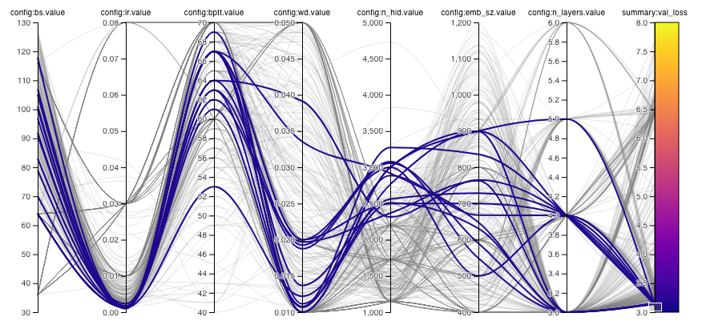

## Hyper-Parameter Sweep With Weights & Biases

Hyper-parameter tuning was conducted with [Weights & Biases](https://www.wandb.com/) an experiment tracking tool that also has the ability to orchestrate hyper-parameter tuning and store model artifacts such as weights and logs.  You can view the results of hyper-parameter tuning in [this project](https://app.wandb.ai/github/issues_lang_model).  Below is a visualization that highlights the parameters associated with the best-performing models on the validation set:



The purple lines corresponding to the best-performing models on the validation set.  An interactive version of this visualization is available for viewing in the [Weights and Biases project](https://app.wandb.ai/github/issues_lang_model).  A list of the hyper-parameters along with the definition of each is avaialable in the [docstring of the model object](https://github.com/machine-learning-apps/IssuesLanguageModel/blob/master//hyperparam_sweep/lm_tune.py#L41-L69).

## Files For Hyper-Parameter Tuning

1. [lm_tune.py](lm_tune.py): contains the model definition with entry points that allows us to change hyper-parameters we want to tune.  The [Fire](https://github.com/google/python-fire) library is used to turn this script into a CLI.

2. [sweep.yaml](sweep.yaml): defines the hyper-parameter sweep for a random grid search.  This is used with the [sweeps feature](https://docs.wandb.com/docs/sweep.html) in Weights & Biases.

3. [sweep_bayes.yaml](sweep_bayes.yaml): defines a hyper-parameter sweep that uses bayesian search. This is used with the [sweeps feature](https://docs.wandb.com/docs/sweep.html) in Weights & Biases. We found that the bayes method worked very well, and did this in parallel with random grid search.

4. [hp_runner.sh](hp_runner.sh): bash script that runs 1 agent per GPU in order to parallelize the hyperparameter sweep as much as possible.  Note that the `sweep_id` has been [hardcoded](https://github.com/machine-learning-apps/IssuesLanguageModel/blob/master/hyperparam_sweep/hp_runner.sh#L7), which you must change if you wish to perform tuning.  As illustrated by this script, we ran this on machines that had 8 GPUs.


## Best Run

[This set of parameters](https://app.wandb.ai/github/issues_lang_model/runs/q5ilech3/overview) performed the best against the validation set.  You can see the model parameters and logs here.  According to [the logs for this run](https://app.wandb.ai/github/issues_lang_model/runs/q5ilech3/logs), these are the hyperparameters associated with the best model:

```bash
lm_tune.py --bptt=63 --bs=83 --emb_sz=836 --lr=0.002319621255816015 --n_hid=3273 --n_layers=4 --one_cycle=True --wd=0.01077738751171411
```

Note that you cannot simply run this command as you must first have the data prepared in the right directory.  Please refer to the [notebooks](/notebooks) folder of this repo for a walk-through on how to train the model.

## Notes About Hyper-Parameter Methodology

We let the tuning run for approximately one week on 24 total GPUs (3 [p3.16xlarge](https://aws.amazon.com/ec2/instance-types/p3/) instances with 8 GPUs each.).  We ran the sweep on 20% of the training data in order more quickly search the hyper-parameter space.  The best parameters found from tuning are used to choose parameters on the full data.  Please see the main [README](/REAMDE.md) of this repo on how to locate the final model.